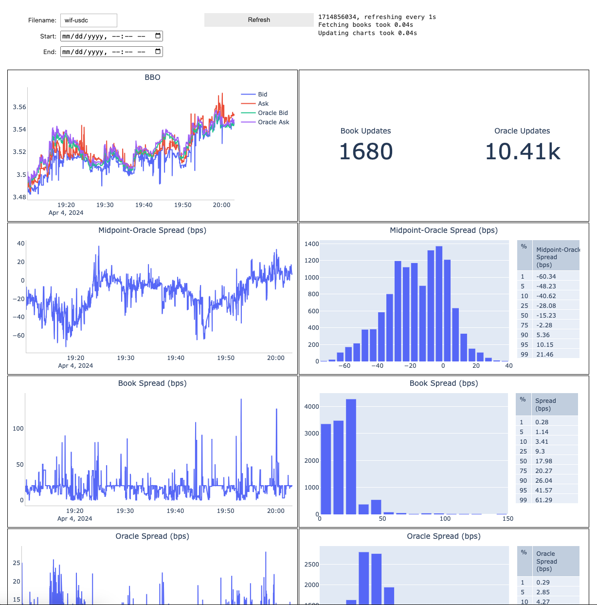
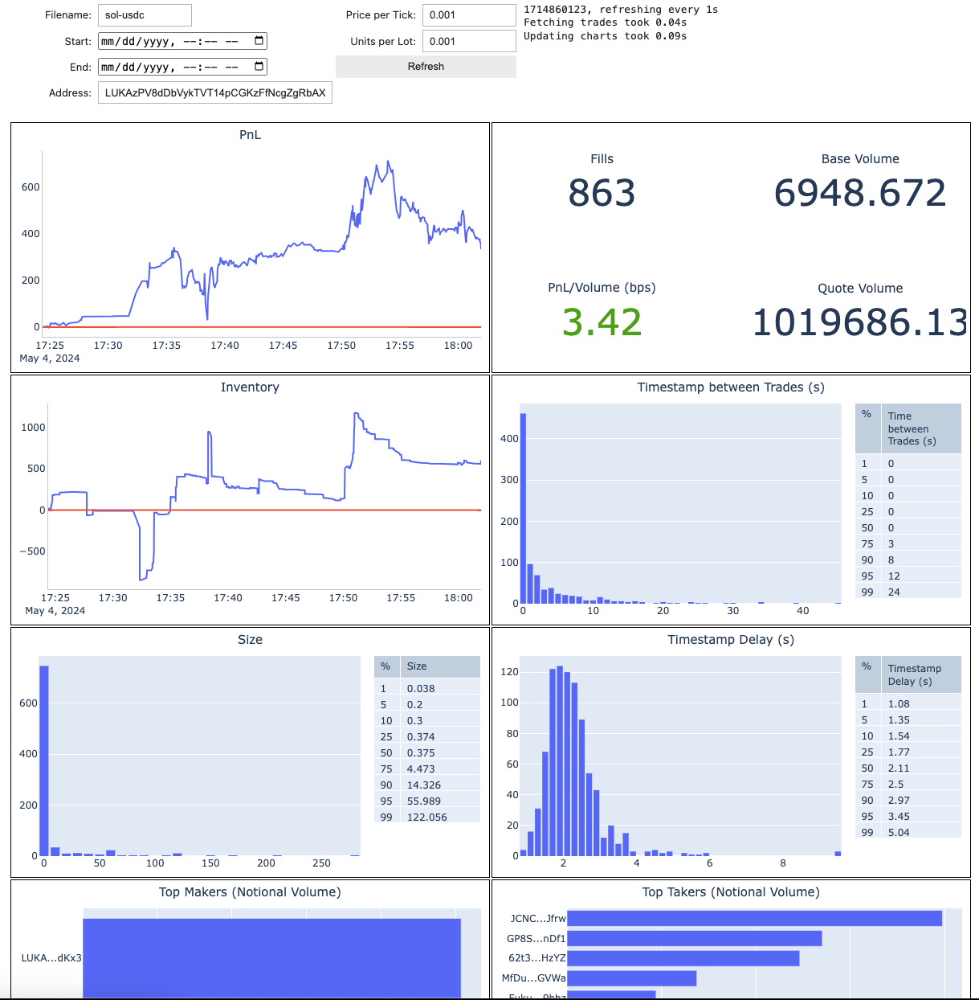

# Phoenix Market Maker

I wrote this code to market make on [Phoenix](https://www.phoenix.trade/) for a few weeks in March 2024. It was nice to return to Solana after a long hiatus, and on-chain market making seemed sufficiently tractable and interesting. RPC services had become much cheaper since 2022, and I was able to get the websocket streams I needed from Helius for only $50/month as opposed to Triton's $2000/month.

Obviously if this codebase was very profitable I wouldn't be open sourcing it, though PnL is not actually the reason I've moved on. Competing on Solana has just become too difficult with my current resources. If you're planning to compete against bots using dedicated nodes and Jito, your strategies have to account for the following:

- You can't get quote uptime above 50% even when spamming tx's directly to the TPU
- Your transactions take several seconds longer to land, so you can't compete for L1 liquidity
- Your websocket feeds for on-chain data are several seconds behind

But beyond infrastructure, on-chain market making introduces a new fixed cost: transaction fees. Phoenix may charge no exchange fees for makers, but every interaction with the exchange is a new Solana transaction. Assuming the [top SOL/USDC maker](https://solscan.io/account/LUKAzPV8dDbVykTVT14pCGKzFfNcgZgRbAXB8AGdKx3) is landing 1 quote/s, that's 86,400 transactions per day with a base + priority fee of ~0.00004 SOL each. If SOL is $150, that's $518/day in transaction fees alone.

Even a strategy that makes 50 bps/day on any amount of volume would need to trade $100k USDC to break even. The aforementioned SOL/USDC bot does eight figures of USDC volume per day and can be long or short 1000 SOL at any given time. Market making for profit is unfortunately not a college student's game.

I'm open sourcing this codebase in case anyone finds it interesting or useful. If you have a Helius API key and really want to try running it, the [.env](.env.example) and [justfile](justfile) are fairly self documenting.

Lastly, if you're behind `LUKAzPV8dDbVykTVT14pCGKzFfNcgZgRbAXB8AGdKx3`, `HATp66ostHKyxkW7BA17mLUUrmjsNTKRfvGkx2w6k67d`, or `jupPAzUY5Ncvrwp3WbagoQL3wr2gJnK9KWwVMFjgCMm` (though I suspect at least the latter two are the same person), I would love to chat.

## Strategy

The quoting strategy is dead simple:

- Stream Kraken or OKX BBO as a starting fair value
- Lean the best bid and ask based on inventory and desired width
- Generate staggered next-level quotes based on the spread

The general Phoenix maker transaction ([example](https://solscan.io/tx/4qoBqjiEctM6J6fUSo2QTa6GP49v7FvitaoJkUg1Fb62pyQAutres4P8Fge5H1FJyGWJK6APBAkPN7aqaHcYaEbC)) that I also use is:

- Set Compute Budget
- Set Compute Price
- Sequence Enforcer
  - This is a program back from the Mango days that ensures a tx sent earlier doesn't execute after a tx sent later. It stops stale quotes from cancelling fresh quotes, but I never got around to writing a Rust implementation so I skip this.
- Phoenix Cancel All Orders
- Phoenix Place Multiple Post Only Orders

To optimize landing transactions, I cache blockhashes and use the `TpuClient` with max fanout slots. A new quote tx with a time-in-force of 5s in the future is sent whenever:

- Phoenix book updates
- Oracle book updates
- Fill websocket updates (`transactionSubscribe` to the market address and parse logs for fills)

One interesting technical note specific to Phoenix is that the optimized orderbook implementation commonly found in HFT systems is unnecessary. To my knowledge the fastest way to get the Phoenix book is to listen to the `accountSubscribe` websocket stream for the market address. The orderbook is encoded within the account data and can be [directly parsed](src/phoenix_utils.rs#L181) into a `(Vec<(f64, f64)>, Vec<(f64, f64)>)`.

The account data also stores trader balances and open orders, so it's probably possible to remove the dependency on the `transactionSubscribe` websocket (which is often delayed).

## Analysis

A significant part of the codebase is infrastructure to stream Phoenix market data and fills, with two Voila notebooks that act as analysis dashboards.

The [book dashboard](notebooks/book-dashboard.ipynb) tracks stats about the Phoenix book and the oracle exchange's book:

The [fill dashboard](notebooks/fill-dashboard.ipynb) tracks the PnL/inventory/volume of any address:

I spent far too much time just watching the fills of the top makers after finishing this dashboard.
